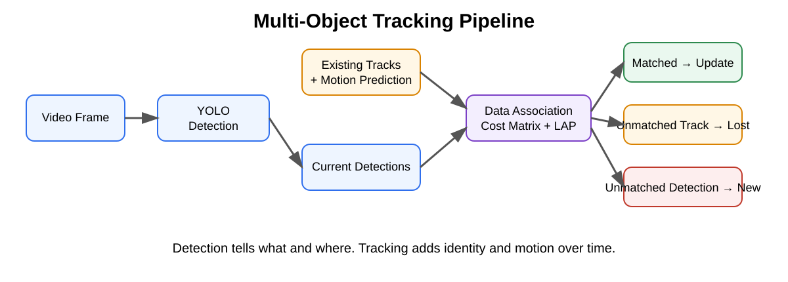
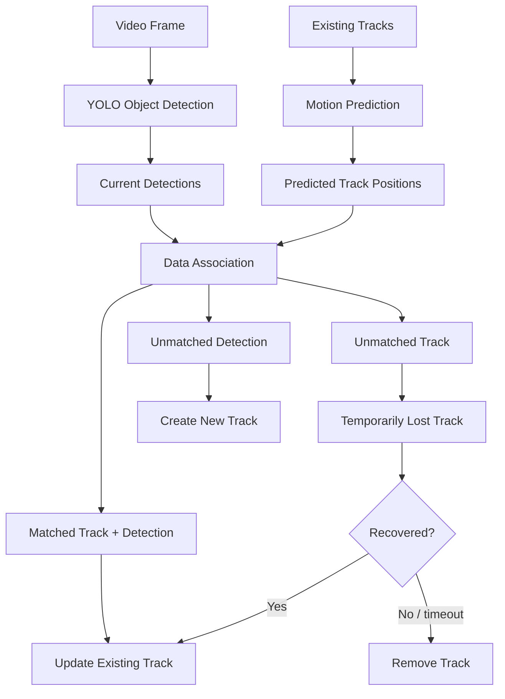
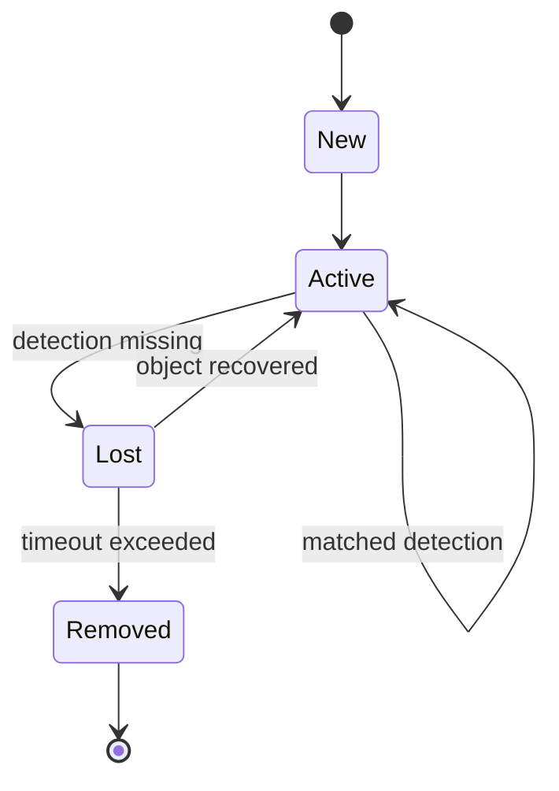
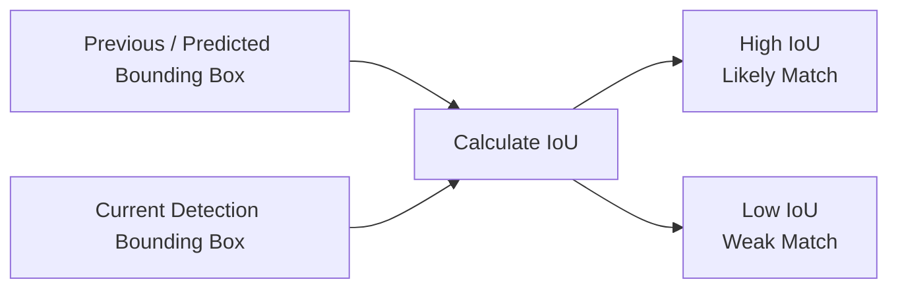

# PhysicalAI Data Engine

PhysicalAI Data Engine converts raw physical-world video into structured, searchable, and AI-ready data for perception, scene understanding, semantic search, evaluation, and future synthetic-data workflows.

<p align="center">
  
</p>

## Roadmap

- ✅ Phase 0 — Environment and project foundation
- ✅ Phase 1 — Video ingestion and frame sampling
- ✅ Phase 2 — Object detection
- 🚧 Phase 3 — Multi-object tracking
- ⏳ Phase 4 — Persistent data engine + web UI
- ⏳ Phase 5 — VLM / GenAI scene understanding
- ⏳ Phase 6 — Scene graph + semantic search
- ⏳ Phase 7 — Model failure mining
- ⏳ Phase 8 — Synthetic scenario generation

The platform direction is:

```text
Raw video / sensors
        ↓
Video ingestion
        ↓
Detection + tracking
        ↓
VLM / GenAI scene understanding
        ↓
Scene graph + semantic search
        ↓
Failure mining / evaluation
        ↓
Synthetic scenario generation
```

---

# Phase 3 — Multi-Object Tracking

Phase 3 extends frame-level object detection into temporal object tracking.

Object detection answers:

```text
What objects are visible in this frame?
Where are they?
```

Object tracking adds:

```text
Is this the same physical object seen in previous frames?
What persistent ID should it have?
How is it moving over time?
```

## Tracking Pipeline



The current implementation uses **YOLO11 + BoT-SORT** through Ultralytics.

Example:

```text
Frame 100 → car #17
Frame 101 → car #17
Frame 102 → car #17
```

The track ID is maintained by the tracker and is different from the detector confidence.

---

## Track Lifecycle

A tracked object conceptually moves through:



This allows a track to survive short periods of occlusion or missed detections.

During experiments, tracks were observed disappearing for several frames and later recovering with the same ID.

---

## Motion Prediction

A track stores information over time rather than only a bounding box.

A simplified state can be represented as:

```text
[x, y, width, height, vx, vy]
```

where:

- `x, y` represent position
- `width, height` represent object size
- `vx, vy` represent image-space velocity

A simple constant-velocity prediction is:

```text
next_x = x + vx
next_y = y + vy
```

Real multi-object trackers use filtering methods such as a **Kalman filter** to combine:

```text
motion prediction
+
new detector measurement
+
uncertainty
```

This reduces jitter and improves association between frames.

---

## Intersection over Union — IoU

<p align="center">
  
</p>

IoU measures how strongly two bounding boxes overlap.

```text
IoU = Intersection Area / Union Area
```

For two example boxes:

```text
Box A = (100, 100, 200, 200)
Box B = (150, 150, 250, 250)
```

each box has:

```text
Area = 100 × 100 = 10,000
```

Their overlap is:

```text
50 × 50 = 2,500
```

Union:

```text
10,000 + 10,000 - 2,500
= 17,500
```

Therefore:

```text
IoU = 2,500 / 17,500
    ≈ 0.143
```

A higher IoU generally indicates a stronger geometric match.



The project implements IoU manually in:

```text
src/physical_ai/perception/tracking_utils.py
```

---

## Tracking Cost Matrix

For simplified IoU matching, the project uses:

```text
cost = 1 - IoU
```

Therefore:

```text
High IoU → Low cost → Better match
Low IoU  → High cost → Worse match
```

Example:

```text
              Detection 0    Detection 1

Track 0          0.219          1.000
Track 1          1.000          0.174
```

The best assignment is:

```text
Track 0 → Detection 0
Track 1 → Detection 1
```

with total cost:

```text
0.219 + 0.174 = 0.393
```

---

## Linear Assignment

Instead of matching every track greedily, the tracking system solves the complete assignment problem.

This avoids situations where one track takes a detection that is a much better match for another track.

The project demonstrates this using the `lap` package:

```text
Predicted Tracks
       +
Current Detections
       ↓
Cost Matrix
       ↓
Linear Assignment Solver
       ↓
Matched Pairs
Unmatched Tracks
Unmatched Detections
```

A cost threshold is also demonstrated:

```python
cost_limit=0.60
```

Example result:

```text
Track 0 → Detection 0
Track 1 → Detection 1
Track 2 → Detection -1
```

`-1` means that Track 2 has no acceptable matching detection.

This leads directly into tracker lifecycle management:

```text
Matched track
→ update existing track

Unmatched track
→ temporarily lost

Unmatched detection
→ potential new track

Lost too long
→ removed
```

---

## Phase 3 Learning Scripts

| Script | Purpose |
|---|---|
| `track_video_demo.py` | Run YOLO + BoT-SORT and inspect persistent track IDs |
| `inspect_tracks.py` | Inspect ID, class, confidence and bounding boxes |
| `track_lifecycle_demo.py` | Observe disappearing and reappearing tracks |
| `inspect_track_motion.py` | Calculate center movement and simple velocity |
| `demo_iou.py` | Implement and test IoU |
| `demo_cost_matrix.py` | Convert IoU values into association costs |
| `demo_assignment.py` | Solve global track-to-detection assignment using LAP |

### Phase 3 Status

```text
✅ Persistent object IDs
✅ Track inspection
✅ Track lifecycle
✅ Motion / velocity fundamentals
✅ Kalman-filter concepts
✅ IoU implemented manually
✅ Cost matrices
✅ Linear assignment
✅ Matched vs unmatched tracks

Next:
⏳ BoT-SORT internals
⏳ Appearance / Re-identification
⏳ Camera-motion compensation
⏳ Reusable PhysicalAI tracking abstraction
⏳ Track visualization and trajectories
```